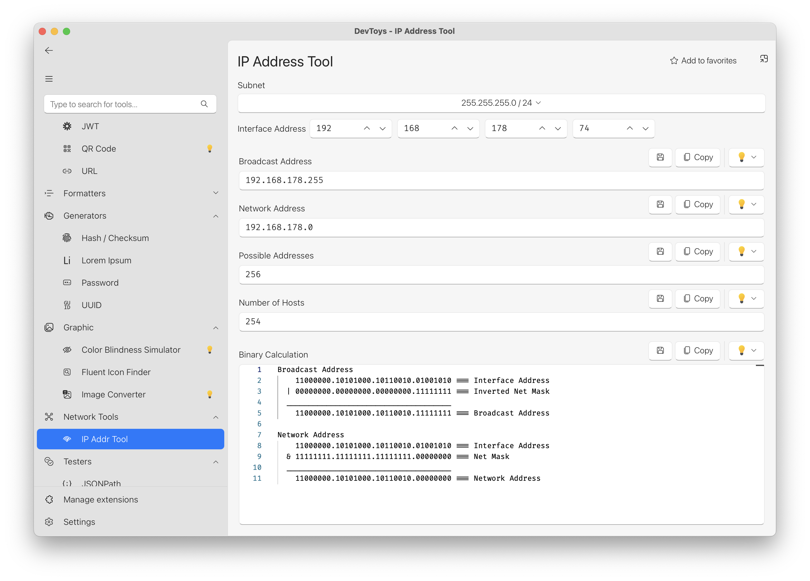

# Dev Toys: Network Tools Extension

This package provides a set of network tools for [DevToys 2.0](https://devtoys.app/).
Currently, this tool only provides an IP address calculator, i.e. with a given subnet mask and an interface IP, it
generates the broadcast & network addresses and shows some related information.
This is my first extension for DevToys and also my first .NET/C# project, so please be kind to me ;).

## Installation

1. Downlaod the nuget package from
   here: https://github.com/users/SteffenAuer/packages/nuget/package/DevToys.Extensions.NetworkTools
2. Follow instructions in DevToys app on how to install it.

## Impressions

### Future Plans

- IPv6 support
- More network tools (e.g. DNS lookup, ping, traceroute, etc.)
- More features for the IP address calculator (e.g. CIDR notation, subnetting, etc.)
- ...